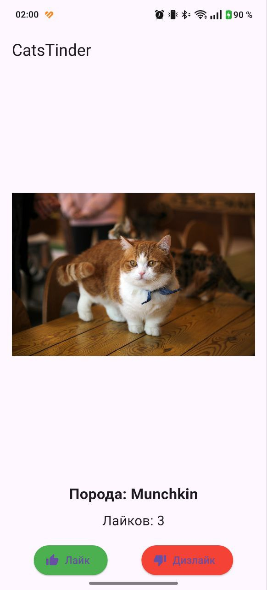
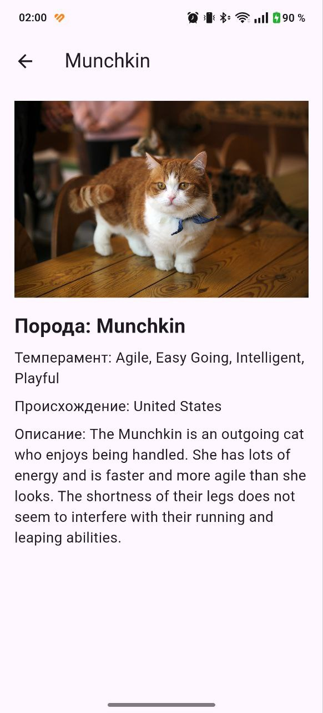
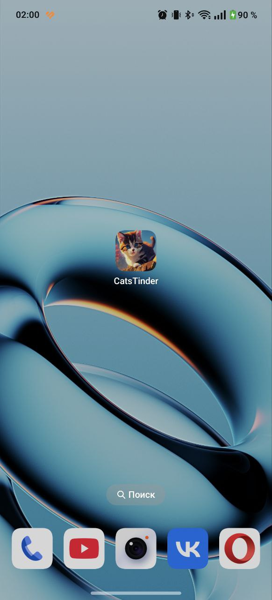

# Cat App

**Описание проекта:**  
Данное приложение отображает случайное изображение котика с информацией о породе, полученное через API [thecatapi.com](https://thecatapi.com). Пользователь может свайпать изображение влево или вправо или использовать кнопки "Лайк" и "Дизлайк". При лайке увеличивается счетчик, а по нажатию на изображение открывается детальный экран с полной информацией о породе.

**Реализованные фичи:**
- Отображение случайного изображения котика с названием породы.
- Свайп (влево – дизлайк, вправо – лайк) для смены котика.
- Две отдельные кнопки: Лайк и Дизлайк.
- Увеличение счетчика лайков при свайпе вправо или нажатии на кнопку "Лайк".
- Переход на детальный экран по нажатию на изображение, где отображается детальная информация о породе.
- Получение данных с использованием [TheCatAPI](https://thecatapi.com) через endpoint `/search` с параметром `has_breeds=1`.
- Использование виджета `CachedNetworkImage` для загрузки изображений.
- Использование `Navigator` для перехода между экранами.
- Применение виджетов `Row` и `Column`.
- Использование `StatefulWidget` для главного экрана и `StatelessWidget` для кнопок.

**Ссылка для скачивания APK:**  
[Скачать APK](app-release.apk) 

**Скриншоты интерфейса приложения:**  
  

